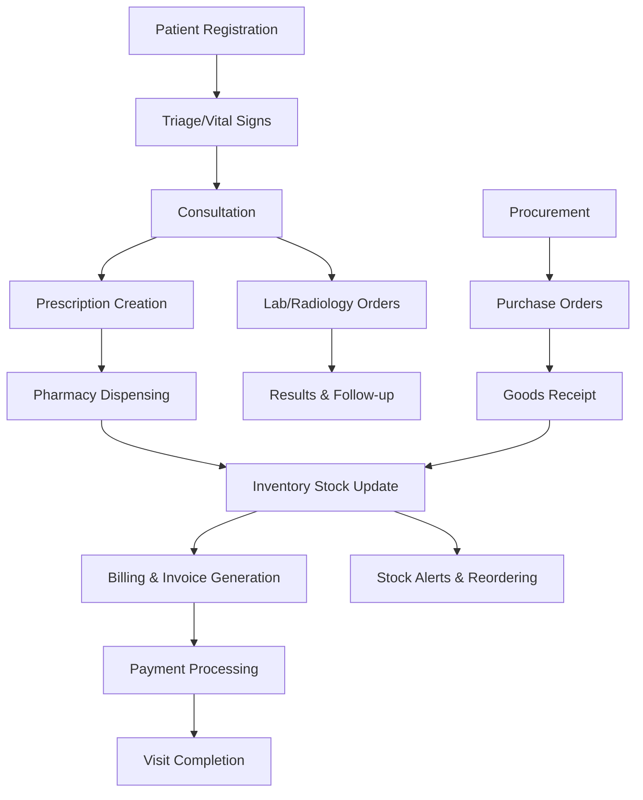

# Uzima Health - Advanced HMIS

A comprehensive Health Management Information System (HMIS) built with Spring Boot, featuring end-to-end patient care workflow from registration to billing, with integrated pharmacy and inventory management.

## 🏥 HMIS Workflow Overview

The system implements a complete HMIS workflow:

1. **Patient Registration** → 2. **Triage/Vital Signs** → 3. **Consultation** → 4. **Prescription** → 5. **Pharmacy Dispensing** → 6. **Inventory Management** → 7. **Billing & Payments**



## ✨ Key Features

### Patient Management
- Comprehensive patient demographics (DOB, gender, ID, insurance, payment type)
- Medical history and contact information
- Visit tracking with unique visit numbers

### Clinical Workflow
- **Triage**: Vital signs recording with automatic BMI calculation and abnormality flagging
- **Consultation**: Symptoms, examination findings, ICD-10 diagnosis, clinical notes
- **Prescription Management**: Drug prescriptions with dosage, frequency, duration
- Real-time stock availability checking

### Pharmacy & Inventory
- **Multi-store inventory**: Main Store, Pharmacy Store, Lab Store
- **Stock tracking**: Batch numbers, expiry dates, FIFO management
- **Automatic stock deduction** on dispensing
- **Procurement workflow**: Purchase orders, goods receipt notes
- **Low stock alerts** and reordering

### Billing & Payments
- Automated invoice generation from services and medications
- Multiple payment methods (Cash, Insurance, NHIF, Mobile Wallet)
- Payment tracking and receipt generation

### User Roles & Security
- **System Administrator**: Full system access
- **Registration Clerk**: Patient registration and demographics
- **Triage Nurse**: Vital signs recording
- **Doctor**: Consultations and prescriptions
- **Pharmacist**: Medication dispensing and pharmacy stock
- **Inventory Manager**: Stock management and procurement
- **Billing Officer**: Invoice generation and payment processing

### Reporting & Analytics
- Patient visit statistics
- Drug consumption and wastage reports
- Revenue analysis by department/payment type
- Stock movement and expiry alerts

## Prerequisites

- Java 17 or higher
- Maven 3.6 or higher

## How to Run

1. Navigate to the project directory:
   ```
   cd /Users/user/Documents/spring-boot/uzima-health
   ```

2. Run the application using Maven:
   ```
   mvn spring-boot:run
   ```

3. The application will start on `http://localhost:8080`

4. Access the H2 database console at `http://localhost:8080/h2-console` (JDBC URL: `jdbc:h2:mem:uzimahealthdb`, Username: `sa`, Password: empty)

## API Endpoints

### Authentication
- `POST /auth/register` - Register a new user
- `POST /auth/login` - Login and receive JWT token

### Patient Management
- `GET /patients` - Get all patients
- `GET /patients/{id}` - Get patient by ID
- `POST /patients` - Create a new patient
- `PUT /patients/{id}` - Update patient
- `DELETE /patients/{id}` - Delete patient

### Visit Management
- `POST /api/visits?patientId={id}&department={dept}` - Create new visit
- `GET /api/visits` - Get all visits
- `GET /api/visits/{id}` - Get visit by ID
- `PUT /api/visits/{id}/status?status={status}` - Update visit status

### Triage
- `POST /api/triage` - Record triage/vitals
- `GET /api/triage/visit/{visitId}` - Get triage for visit

### Consultation
- `POST /api/consultations` - Record consultation
- `GET /api/consultations/visit/{visitId}` - Get consultation for visit

### Prescriptions
- `POST /api/prescriptions` - Create prescription
- `POST /api/prescriptions/{id}/dispense` - Dispense prescription
- `GET /api/prescriptions/visit/{visitId}` - Get prescriptions for visit

### Appointments (Legacy)
- `GET /appointments` - Get all appointments
- `GET /appointments/patient/{patientId}` - Get appointments for a patient
- `POST /appointments` - Create a new appointment
- `PUT /appointments/{id}` - Update appointment
- `DELETE /appointments/{id}` - Delete appointment

### Chat & Video (Telemedicine)
- `GET /chat/{sender}/{receiver}` - Get chat messages between two users
- `POST /chat` - Send a chat message
- `GET /videocalls` - Get all video calls
- `POST /videocalls` - Schedule a new video call
- `PUT /videocalls/{id}` - Update video call status

## Sample Data

On startup, the application loads comprehensive sample data:
- **Users**: admin, doctor, nurse, pharmacist, clerk with appropriate roles
- **Patients**: John Doe and Jane Smith with full demographics
- **Visits**: Active and completed visits
- **Clinical Data**: Triage vitals, consultations, prescriptions
- **Inventory**: Sample drugs (Paracetamol, Amoxicillin) with stock
- **Billing**: Sample invoices and payments

## Security

All endpoints except `/auth/**` require authentication. Include the JWT token in the Authorization header as `Bearer <token>`.

Role-based access control ensures users can only perform actions appropriate to their roles.

## Project Structure

```
src/main/java/com/uzimahealth/
├── UzimaHealthApplication.java
├── config/
│   └── DataLoader.java
├── controller/
│   ├── AuthController.java
│   ├── AppointmentController.java
│   ├── ChatController.java
│   ├── ConsultationController.java
│   ├── PatientController.java
│   ├── PrescriptionController.java
│   ├── TriageController.java
│   ├── VideoCallController.java
│   └── VisitController.java
├── model/
│   ├── Appointment.java
│   ├── ChatMessage.java
│   ├── Consultation.java
│   ├── GoodsReceivedItem.java
│   ├── GoodsReceivedNote.java
│   ├── Invoice.java
│   ├── Item.java
│   ├── Patient.java
│   ├── Payment.java
│   ├── Prescription.java
│   ├── PrescriptionItem.java
│   ├── PurchaseOrder.java
│   ├── PurchaseOrderItem.java
│   ├── Stock.java
│   ├── StockLedger.java
│   ├── Triage.java
│   ├── User.java
│   ├── VideoCall.java
│   └── Visit.java
├── repository/
│   ├── AppointmentRepository.java
│   ├── ChatMessageRepository.java
│   ├── ConsultationRepository.java
│   ├── GoodsReceivedItemRepository.java
│   ├── GoodsReceivedNoteRepository.java
│   ├── InvoiceRepository.java
│   ├── ItemRepository.java
│   ├── PatientRepository.java
│   ├── PaymentRepository.java
│   ├── PrescriptionItemRepository.java
│   ├── PrescriptionRepository.java
│   ├── PurchaseOrderItemRepository.java
│   ├── PurchaseOrderRepository.java
│   ├── StockLedgerRepository.java
│   ├── StockRepository.java
│   ├── TriageRepository.java
│   ├── UserRepository.java
│   ├── VideoCallRepository.java
│   └── VisitRepository.java
├── security/
│   ├── JwtRequestFilter.java
│   ├── JwtUtil.java
│   ├── SecurityConfig.java
│   └── UserDetailsServiceImpl.java
└── service/
    ├── AppointmentService.java
    ├── ChatService.java
    ├── ConsultationService.java
    ├── PatientService.java
    ├── PrescriptionService.java
    ├── StockService.java
    ├── TriageService.java
    ├── UserService.java
    ├── VideoCallService.java
    └── VisitService.java
```

## Technologies Used

- **Spring Boot 3.4.0**: Framework for building the application
- **Spring Security**: Authentication and authorization with JWT
- **Spring Data JPA**: Data persistence with H2 database
- **H2 Database**: In-memory database for development
- **JWT**: Token-based authentication
- **Maven**: Build and dependency management
- **Java 17**: Programming language

## Future Enhancements

- Lab and Radiology module integration
- Advanced reporting and analytics dashboard
- Mobile app integration
- NHIF/Insurance claims processing
- Multi-facility support
- Electronic health records (EHR) integration