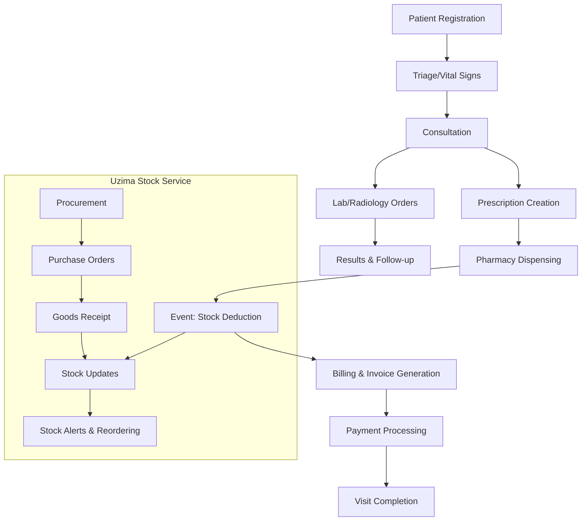

# Uzima Health - Advanced HMIS

A comprehensive Health Management Information System (HMIS) built with Spring Boot, featuring end-to-end patient care workflow from registration to billing, with event-driven integration to a separate inventory management system.

## 🏥 Microservices Architecture

The Uzima Health system is now split into two microservices:

1. **Uzima Health** (HMIS): Patient management, clinical workflows, and billing
2. **Uzima Stock** (Inventory): Complete ERPNext-style inventory management with event-driven communication

Services communicate through RabbitMQ-based event messaging for real-time stock updates and prescription dispensing.

## 🏥 HMIS Workflow Overview

The system implements a complete HMIS workflow:

1. **Patient Registration** → 2. **Triage/Vital Signs** → 3. **Consultation** → 4. **Prescription** → 5. **Pharmacy Dispensing** → 6. **Billing & Payments**



## ✨ Key Features

### Patient Management
- Comprehensive patient demographics (DOB, gender, ID, insurance, payment type)
- Medical history and contact information
- Visit tracking with unique visit numbers

### Clinical Workflow
- **Triage**: Vital signs recording with automatic BMI calculation and abnormality flagging
- **Consultation**: Symptoms, examination findings, ICD-10 diagnosis, clinical notes
- **Prescription Management**: Drug prescriptions with dosage, frequency, duration
- Real-time stock availability checking via event communication

### Event-Driven Integration
- **Prescription Dispensing**: Events trigger automatic stock deduction in inventory service
- **Stock Alerts**: Real-time notifications for low stock and expiring items
- **Procurement Workflow**: Automated purchase order generation based on stock levels

### Billing & Payments
- Automated invoice generation from services and medications
- Multiple payment methods (Cash, Insurance, NHIF, Mobile Wallet)
- Payment tracking and receipt generation

### User Roles & Security
- **System Administrator**: Full system access
- **Registration Clerk**: Patient registration and demographics
- **Triage Nurse**: Vital signs recording
- **Doctor**: Consultations and prescriptions
- **Pharmacist**: Medication dispensing and pharmacy stock
- **Inventory Manager**: Stock management and procurement
- **Billing Officer**: Invoice generation and payment processing

### Reporting & Analytics
- Patient visit statistics
- Drug consumption and wastage reports
- Revenue analysis by department/payment type
- Stock movement and expiry alerts

## Prerequisites

- Java 17 or higher
- Maven 3.6 or higher
- RabbitMQ (for event messaging between services)

## How to Run

### 1. Start RabbitMQ
```bash
# Using Docker
docker run -d --name rabbitmq -p 5672:5672 -p 15672:15672 rabbitmq:3-management

# Or install locally and start the service
```

### 2. Start Uzima Stock Service
```bash
cd /Users/user/Documents/spring-boot/uzima-stock
mvn spring-boot:run
```
Service will start on `http://localhost:8081`

### 3. Start Uzima Health Service
```bash
cd /Users/user/Documents/spring-boot/uzima-health
mvn spring-boot:run
```
Service will start on `http://localhost:8080`

### 4. Access Applications
- **Uzima Health (HMIS)**: `http://localhost:8080`
- **Uzima Stock (Inventory)**: `http://localhost:8081`
- **H2 Console (Health)**: `http://localhost:8080/h2-console`
- **H2 Console (Stock)**: `http://localhost:8081/h2-console`
- **RabbitMQ Management**: `http://localhost:15672` (guest/guest)

## API Endpoints

### Uzima Health Service (Port 8080)

#### Authentication
- `POST /auth/register` - Register a new user
- `POST /auth/login` - Login and receive JWT token

#### Patient Management
- `GET /patients` - Get all patients
- `GET /patients/{id}` - Get patient by ID
- `POST /patients` - Create a new patient
- `PUT /patients/{id}` - Update patient
- `DELETE /patients/{id}` - Delete patient

#### Visit Management
- `POST /api/visits?patientId={id}&department={dept}` - Create new visit
- `GET /api/visits` - Get all visits
- `GET /api/visits/{id}` - Get visit by ID
- `PUT /api/visits/{id}/status?status={status}` - Update visit status

#### Clinical Workflow
- `POST /api/triage` - Record triage/vitals
- `GET /api/triage/visit/{visitId}` - Get triage for visit
- `POST /api/consultations` - Record consultation
- `GET /api/consultations/visit/{visitId}` - Get consultation for visit
- `POST /api/prescriptions` - Create prescription
- `POST /api/prescriptions/{id}/dispense` - Dispense prescription (triggers stock event)
- `GET /api/prescriptions/visit/{visitId}` - Get prescriptions for visit

### Uzima Stock Service (Port 8081)

#### Authentication
- `POST /auth/login` - Login and receive JWT token

#### Inventory Management
- `GET /api/stock/items` - Get all items
- `GET /api/stock/items/{itemCode}` - Get item by code
- `POST /api/stock/items` - Create new item
- `GET /api/stock/warehouses` - Get all warehouses
- `POST /api/stock/warehouses` - Create new warehouse

## Event Communication

Services communicate through RabbitMQ events:

### Events Published by Uzima Health:
- **PRESCRIPTION_DISPENSED**: Triggers stock deduction when medication is dispensed
- **STOCK_ADJUSTMENT**: Manual stock adjustments

### Events Consumed by Uzima Stock:
- Automatic stock ledger entries
- Real-time inventory updates
- Low stock alerts generation

## Sample Data

### Uzima Health Service:
- **Users**: admin, doctor, nurse, pharmacist, clerk with appropriate roles
- **Patients**: John Doe and Jane Smith with full demographics
- **Visits**: Active and completed visits
- **Clinical Data**: Triage vitals, consultations, prescriptions

### Uzima Stock Service:
- **Items**: Paracetamol, Amoxicillin with complete specifications
- **Warehouses**: Pharmacy Store, Main Store
- **Stock Entries**: Initial stock with batch tracking
- **Procurement**: Sample purchase receipts and material requests

## Security

All endpoints except `/auth/**` require authentication. Include the JWT token in the Authorization header as `Bearer <token>`.

Role-based access control ensures users can only perform actions appropriate to their roles.

## Project Structure

### Uzima Health Service
```
src/main/java/com/uzimahealth/
├── UzimaHealthApplication.java
├── config/DataLoader.java
├── controller/
├── model/ (HMIS entities only)
├── repository/ (HMIS repositories only)
├── security/
└── service/
    ├── HealthEventPublisher.java (Event communication)
    └── ... (HMIS services)
```

### Uzima Stock Service
```
src/main/java/com/uzimahealth/
├── UzimaStockApplication.java
├── config/DataLoader.java
├── controller/StockController.java
├── model/ (Stock entities only)
├── repository/ (Stock repositories only)
├── security/
└── service/
    ├── StockEventService.java
    ├── StockEventConsumer.java (Event processing)
    └── ... (Stock services)
```

## Technologies Used

- **Spring Boot 3.2.0**: Framework for building microservices
- **Spring Security**: Authentication and authorization with JWT
- **Spring Data JPA**: Data persistence with H2 database
- **Spring Cloud Stream**: Event-driven communication via RabbitMQ
- **H2 Database**: In-memory database for development
- **RabbitMQ**: Message broker for inter-service communication
- **JWT**: Token-based authentication
- **Maven**: Build and dependency management
- **Java 17**: Programming language

## Future Enhancements

- Lab and Radiology module integration
- Advanced reporting and analytics dashboard
- Mobile app integration
- NHIF/Insurance claims processing
- Multi-facility support
- Electronic health records (EHR) integration
- Kubernetes deployment with service mesh
- API Gateway for unified access